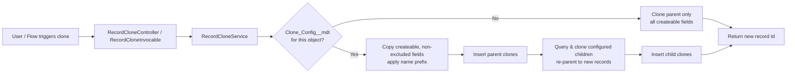
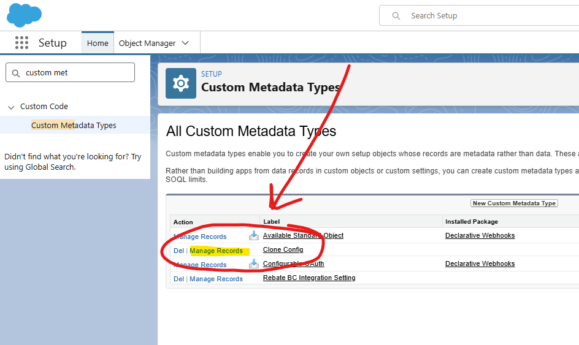
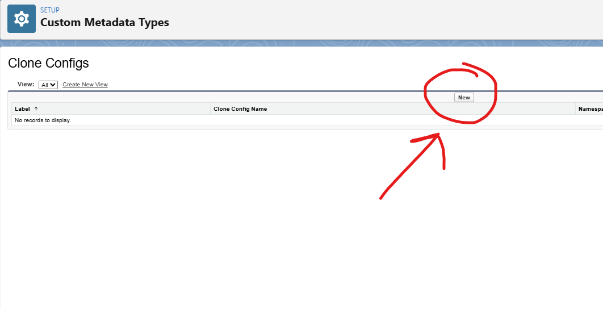

# Deep Clone for Salesforce

[](https://github.com/PriceFB/Deep-Clone-For-Salesforce/actions/workflows/ci.yml)
[](./LICENSE)
[](https://developer.salesforce.com)
[](#continuous-integration)
[](https://prettier.io)
[](#contributing)

A configuration-driven **deep clone** utility for Salesforce. The standard **Clone** button copies a single record and every field. **Deep Clone for Salesforce** lets admins declare — with **Custom Metadata**, no Apex changes — which **related child records** to clone alongside the parent and which **fields to skip**, for any standard or custom object.

> Enable deep clone on a new object by adding one `Clone_Config__mdt` record. No code. No deployment of new Apex.

---

## Contents

- [Why](#why)
- [Features](#features)
- [How it works](#how-it-works)
- [Screenshots](#screenshots)
- [Install](#install)
- [Configure](#configure)
- [Use it](#use-it)
- [Metadata reference](#metadata-reference)
- [Design notes](#design-notes)
- [Local development & testing](#local-development--testing)
- [Continuous integration](#continuous-integration)
- [Contributing](#contributing)
- [License](#license)

---

## Why

Teams constantly need to "clone this record **and** its children" — a parent record with its line items, its tasks, its child configuration rows. Two things make this painful with the platform today:

1. **Standard Clone is shallow.** It duplicates a single record and always copies _every_ field, including ones you never want carried over (external IDs, legacy keys, status fields).
2. **One-off Apex clone classes don't scale.** Every object gets its own hand-written clone method, and each one has to be re-tested and re-deployed.

**Before vs. after:**

|                                          | Standard Clone | Deep Clone for Salesforce          |
| ---------------------------------------- | -------------- | ---------------------------------- |
| Copies related child records             | ❌             | ✅ (configurable per relationship) |
| Skip specific fields                     | ❌             | ✅ (parent and child)              |
| Add a name prefix (e.g. `Copy of `)      | ❌             | ✅                                 |
| Works on any object without new code     | ❌             | ✅ (Custom Metadata driven)        |
| Bulk-safe (clone many records at once)   | ❌             | ✅                                 |
| Available in LWC, Quick Action, and Flow | Partial        | ✅                                 |

---

## Features

- **Config-driven** — enable an object by adding a `Clone_Config__mdt` record; no Apex edits.
- **Deep** — clone configured child relationships and re-parent them to the new record.
- **Selective** — exclude fields on the parent and per child relationship.
- **Safe** — respects the running user's CRUD and field-level security (user-mode SOQL/DML; only accessible + createable fields are copied).
- **Bulkified** — no SOQL/DML inside record loops; clone one record or hundreds.
- **Multi-surface** — a Lightning Web Component, a record Quick Action, and a Flow `@InvocableMethod`.

---

## How it works



---

## Screenshots

Enabling deep clone for an object is pure configuration — no code, no deploy. Find **Clone Config** under Custom Metadata Types, open **Manage Records**, and add a record:

| 1. Setup → Custom Metadata Types → Manage Records                         | 2. New Clone Config record                                                |
| ------------------------------------------------------------------------- | ------------------------------------------------------------------------- |
|  |  |

> **Demo GIF (recommended):** record a short clip of the LWC on a record page — confirmation panel → **Clone** → auto-navigate to the new record — save it as `docs/screenshots/deep-clone-demo.gif`, and it will render here:
>
> ``

---

## Install

### Option A — Deploy the source with the Salesforce CLI

```bash
git clone https://github.com/PriceFB/Deep-Clone-For-Salesforce.git
cd Deep-Clone-For-Salesforce

# Authorize your org (skip if already authorized)
sf org login web --alias my-org

# Deploy
sf project deploy start --target-org my-org

# (Optional) run the Apex tests
sf apex run test --test-level RunLocalTests --code-coverage --result-format human --target-org my-org
```

### Option B — Unlocked package (one-click install)

Install the packaged version directly — no clone, no source deploy:

```bash
# Replace 04t... with the version Id from the latest GitHub release
sf package install --package 04tXXXXXXXXXXXXXXX --target-org my-org --wait 10
```

> The current package version Id is published on the [latest release](https://github.com/PriceFB/Deep-Clone-For-Salesforce/releases/latest). To (re)build it from a Dev Hub:
>
> ```bash
> sf package create --name "Deep Clone for Salesforce" --package-type Unlocked --path force-app --target-dev-hub my-devhub
> sf package version create --package "Deep Clone for Salesforce" --installation-key-bypass --wait 20 --code-coverage --target-dev-hub my-devhub
> sf package version promote --package "Deep Clone for Salesforce@1.0.0-1" --target-dev-hub my-devhub
> ```

---

## Configure

Deep-clone behavior for an object is defined by a **`Clone_Config__mdt`** record. A sample record, **Account Deep Clone**, ships with the project:

| Field                         | Sample value             | Meaning                                             |
| ----------------------------- | ------------------------ | --------------------------------------------------- |
| `Object_API_Name__c`          | `Account`                | The object to deep-clone.                           |
| `Child_Relationship_Names__c` | `Contacts`               | Child relationships to clone (comma-separated).     |
| `Excluded_Fields__c`          | `AccountNumber,Sic`      | Parent fields to skip.                              |
| `Child_Excluded_Fields__c`    | `{"Contacts":["Email"]}` | Per-child fields to skip (JSON).                    |
| `Name_Prefix__c`              | `Copy of `               | Text prepended to the parent's Name.                |
| `Active__c`                   | `true`                   | Turn deep-clone on/off without deleting the record. |

**To enable a new object** (e.g. clone an `Order` with its `OrderItems`):

1. **Setup → Custom Metadata Types → Clone Config → Manage Records → New.**
2. Set `Object API Name` to `Order`.
3. Set `Child Relationship Names` to `OrderItems`.
4. Optionally set excluded fields, child-excluded fields, and a name prefix.
5. Check `Active` and save.

That's it — no code changes.

> **Tip:** `Child Relationship Names` are the _child relationship names_, not the child object names. Find them under the parent object's **Related Lists** or via a describe (`SObjectType.Account.getDescribe().getChildRelationships()`).

---

## Use it

### On a record page (LWC)

1. Edit the object's **Lightning Record Page** in the Lightning App Builder.
2. Drag the **Deep Clone** component onto the page and save/activate.
3. Open a record — the component shows what will be cloned and a **Clone** button. Clicking it clones the record (and children) and navigates to the new record.

### As a Quick Action

Create a **Screen Action** Quick Action that hosts the `deepClone` component, then add it to the object's page layout.

### From a Flow

Use the **Deep Clone Record** invocable action:

- **Input:** `Record Id` (the record to clone).
- **Output:** `Cloned Record Id`, `Is Success`, `Error Message`, `Error Type`.

The action is bulk-safe: pass a collection of records and it clones them in a single service call.

### From Apex

```apex
// Single record — returns the new record Id
Id newId = RecordCloneService.cloneRecord(accountId);

// Bulk — returns the new parent Ids
List<Id> newIds = RecordCloneService.cloneRecords(accountIds);

// Bulk with source-to-clone mapping
Map<Id, Id> newByOld = RecordCloneService.cloneRecordsMapped(accountIds);
```

---

## Metadata reference

### Custom Metadata Type: `Clone_Config__mdt`

| Field API name                | Type      | Required | Description                                           |
| ----------------------------- | --------- | :------: | ----------------------------------------------------- |
| `Object_API_Name__c`          | Text(255) |    ✅    | Parent object API name.                               |
| `Child_Relationship_Names__c` | Long Text |          | Comma-separated child relationship names.             |
| `Excluded_Fields__c`          | Long Text |          | Comma-separated parent field API names to skip.       |
| `Child_Excluded_Fields__c`    | Long Text |          | JSON map of child relationship → excluded field list. |
| `Name_Prefix__c`              | Text(80)  |          | Prefix added to the parent's Name field.              |
| `Active__c`                   | Checkbox  |          | Whether the configuration is applied.                 |

### Apex

| Class                   | Responsibility                                                                     |
| ----------------------- | ---------------------------------------------------------------------------------- |
| `RecordCloneService`    | Core, config-driven clone engine (dynamic describe, FLS-safe copy, bulk children). |
| `RecordCloneController` | `@AuraEnabled` wrapper for the LWC (`doClone`, `getConfig`).                       |
| `RecordCloneInvocable`  | `@InvocableMethod` for Flow (`Deep Clone Record`).                                 |
| `TestDataFactory`       | Shared test data builders (test-only).                                             |

---

## Design notes

- **Security first.** All reads use `WITH USER_MODE` / `Database.queryWithBinds(..., AccessLevel.USER_MODE)` and all writes use `Database.insert(..., AccessLevel.USER_MODE)`. Only fields that are both **accessible** and **createable** for the running user are copied, so the tool never leaks or writes data the user isn't entitled to.
- **No hardcoded field lists.** Field selection is 100% dynamic describe; formula, roll-up, auto-number, and audit fields are naturally excluded because they aren't createable.
- **Bulk-safe.** Records are grouped by type; there is no SOQL or DML inside record loops. Child records are queried once per configured relationship and inserted once per child type.
- **Injection-safe.** Dynamic SOQL is built only from schema-derived object/field names; all record Ids are passed as bind variables.
- **Governor limits for large trees.** A single synchronous transaction is bounded by platform limits (e.g. DML rows, CPU). For very large parent/child volumes, drive the clone from an asynchronous context (Queueable/Batch) that calls `RecordCloneService.cloneRecords(...)` with appropriately sized batches.

---

## Local development & testing

Requires [Node.js](https://nodejs.org) 18+ and the [Salesforce CLI](https://developer.salesforce.com/tools/salesforcecli).

```bash
npm install            # install dev tooling (ESLint, Prettier, Jest)

npm run prettier:verify # check formatting
npm run lint            # lint Lightning Web Components
npm run test:unit       # run LWC Jest unit tests
```

Apex tests run in an org:

```bash
sf apex run test --test-level RunLocalTests --code-coverage --result-format human --target-org my-org
```

The Apex test suite covers single and bulk (200+) clones, child cloning, excluded-field and name-prefix behavior, the no-config fallback, and FLS handling via `System.runAs`. The service is designed for testability: tests inject configuration in memory (`RecordCloneService.configOverride`) so they never depend on deployed metadata or org data.

### Test coverage

| Layer             | Tool                   | Coverage                                                                    |
| ----------------- | ---------------------- | --------------------------------------------------------------------------- |
| LWC (`deepClone`) | Jest (`sfdx-lwc-jest`) | **100%** statements / functions / lines (12 tests)                          |
| Apex              | `RunLocalTests`        | Enforced on deploy (Salesforce requires ≥ 75% org-wide); suite targets 90%+ |

LWC coverage is measured on every CI run with `npm run test:unit:coverage`. Apex coverage is enforced by the optional scratch-org CI job, which deploys the source and runs `sf apex run test --test-level RunLocalTests --code-coverage` (see [Continuous integration](#continuous-integration)).

---

## Continuous integration

Every push and pull request runs the [CI workflow](.github/workflows/ci.yml):

- **Lint & Unit Tests** (always) — Prettier formatting check, ESLint, and LWC Jest tests. No org required.
- **Scratch Org Apex Tests** (optional) — deploys to a fresh scratch org and runs the Apex suite. This job activates only when a `DEVHUB_SFDX_URL` repository secret is present, so the pipeline stays green for forks and contributors without org access.

To enable the scratch-org job, add a `DEVHUB_SFDX_URL` secret containing your Dev Hub's [SFDX auth URL](https://developer.salesforce.com/docs/atlas.en-us.sfdx_cli_reference.meta/sfdx_cli_reference/cli_reference_org_commands_unified.htm):

```bash
sf org display --target-org my-devhub --verbose --json
# copy the "sfdxAuthUrl" value into the DEVHUB_SFDX_URL GitHub Actions secret
```

---

## Contributing

Issues and pull requests are welcome. Please run `npm run prettier` and `npm run lint` before submitting, and keep the project **generic** — examples and tests use standard objects only.

---

## License

[MIT](./LICENSE) © 2026 Jonathan Leyva
